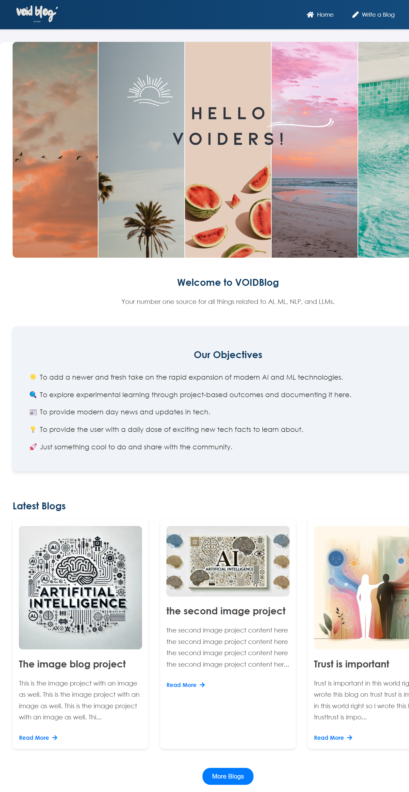

<body>

<h1>VOIDBlog</h1>

Welcome to VOIDBlog, your number-one source for all things related to AI, ML, NLP, and LLMs. We're dedicated to providing you the very best of exploration, analysis, and fun. Founded in 2024 by Abhishek Shah, VOIDBlog has come a long way from its beginnings in the year 2024. When Abhishek first started out, his passion for blogs drove him to start his own platform.

<h2>Screenshot</h2>
        
        
<h2>Table of Contents</h2>
<ul>
    <li><a href="#about-the-project">About The Project</a></li>
    <li><a href="#built-with">Built With</a></li>
    <li><a href="#getting-started">Getting Started</a></li>
    <li><a href="#usage">Usage</a></li>
    <li><a href="#contributing">Contributing</a></li>
    <li><a href="#license">License</a></li>
    <li><a href="#contact">Contact</a></li>
    <li><a href="#acknowledgements">Acknowledgements</a></li>
</ul>

<h2 id="about-the-project">About The Project</h2>

VOIDBlog is a modern blogging platform that focuses on AI, ML, NLP, and LLMs. The platform allows users to create, edit, delete, and view blog posts. It supports image uploads and displays them in blog posts and on the main page. The platform is built with Flask and is deployed on Vercel, using Google Cloud SQL for the database.

<h2 id="built-with">Built With</h2>
<ul>
    <li><a href="https://flask.palletsprojects.com/">Flask</a></li>
    <li><a href="https://www.sqlalchemy.org/">SQLAlchemy</a></li>
    <li><a href="https://cloud.google.com/sql">Google Cloud SQL</a></li>
    <li><a href="https://vercel.com/">Vercel</a></li>
    <li><a href="https://getbootstrap.com/">Bootstrap</a> (for styling)</li>
</ul>

<h2 id="getting-started">Getting Started</h2>

To get a local copy up and running follow these simple steps.

<h3>Prerequisites</h3>
<ul>
    <li>Python 3.6 or higher</li>
    <li>pip (Python package installer)</li>
    <li>Google Cloud account</li>
    <li>Vercel account</li>
</ul>

<h3>Installation</h3>
<ol>
    <li>Clone the repo</li>
</ol>
<pre><code>git clone https://github.com/your_username_/Project-Name.git</code></pre>
<ol start="2">
    <li>Create a virtual environment</li>
</ol>
<pre><code>python3 -m venv venv</code></pre>
<ol start="3">
    <li>Activate the virtual environment</li>
</ol>
<pre><code>source venv/bin/activate # On Windows use `venv\Scripts\activate`</code></pre>
<ol start="4">
    <li>Install dependencies</li>
</ol>
<pre><code>pip install -r requirements.txt</code></pre>
<ol start="5">
    <li>Set up the database</li>
</ol>

Create a Google Cloud SQL instance and set up the database. Update your environment variables with the connection details.

<pre><code>export DATABASE_URL="mysql+pymysql://<USERNAME>:<PASSWORD>@/<DATABASE_NAME>?unix_socket=/cloudsql/<INSTANCE_CONNECTION_NAME>"</code></pre>
<ol start="6">
    <li>Run the application</li>
</ol>
<pre><code>flask run</code></pre>

<h2 id="usage">Usage</h2>

Use this space to show useful examples of how a project can be used. Additional screenshots, code examples and demos work well in this space. You may also link to more resources.

<h2 id="contributing">Contributing</h2>

Contributions are what make the open source community such an amazing place to be learn, inspire, and create. Any contributions you make are <strong>greatly appreciated</strong>.

<ol>
    <li>Fork the Project</li>
    <li>Create your Feature Branch (<code>git checkout -b feature/AmazingFeature</code>)</li>
    <li>Commit your Changes (<code>git commit -m 'Add some AmazingFeature'</code>)</li>
    <li>Push to the Branch (<code>git push origin feature/AmazingFeature</code>)</li>
    <li>Open a Pull Request</li>
</ol>

<h2 id="license">License</h2>

Distributed under the MIT License. See <a href="https://github.com/your_username_/Project-Name/blob/main/LICENSE">LICENSE</a> for more information.

<h2 id="contact">Contact</h2>

Abhishek Shah

<ul>
    <li>Email: <a href="mailto:www.abhishekshah007@gmail.com">www.abhishekshah007@gmail.com</a></li>
    <li>LinkedIn: <a href="https://www.linkedin.com/in/abhiverse01/">https://www.linkedin.com/in/abhiverse01/</a></li>
    <li>GitHub: <a href="https://www.github.com/abhiverse01">https://www.github.com/abhiverse01</a></li>
</ul>

<h2 id="acknowledgements">Acknowledgements</h2>
<ul>
    <li><a href="https://flask.palletsprojects.com/">Flask</a></li>
    <li><a href="https://www.sqlalchemy.org/">SQLAlchemy</a></li>
    <li><a href="https://cloud.google.com/sql">Google Cloud SQL</a></li>
    <li><a href="https://vercel.com/">Vercel</a></li>
    <li><a href="https://getbootstrap.com/">Bootstrap</a></li>
</ul>

<h2>Screenshot</h2>
        

</body>

